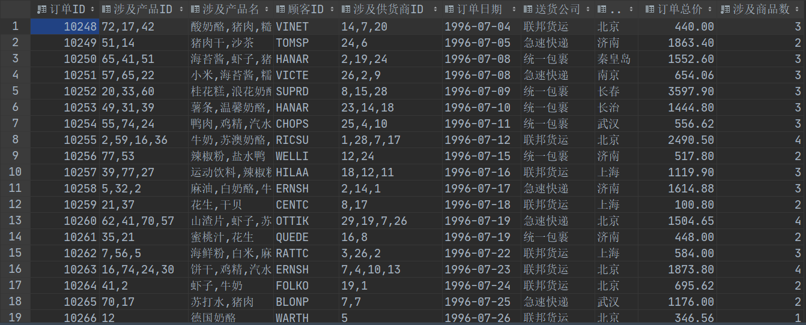
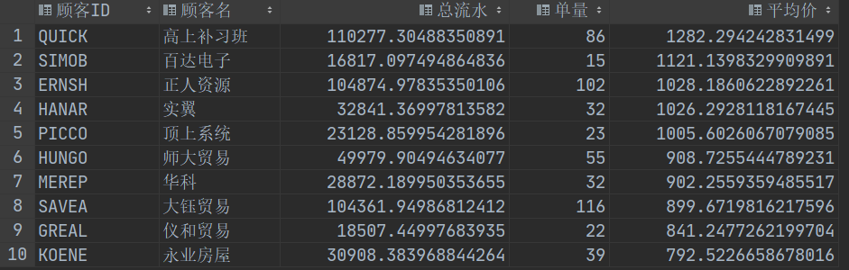
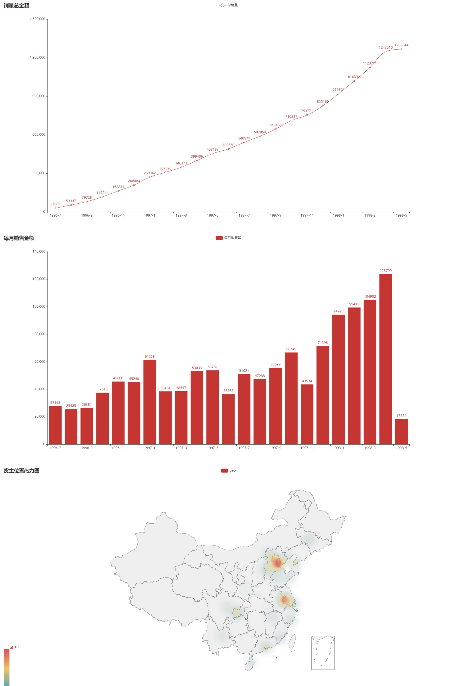
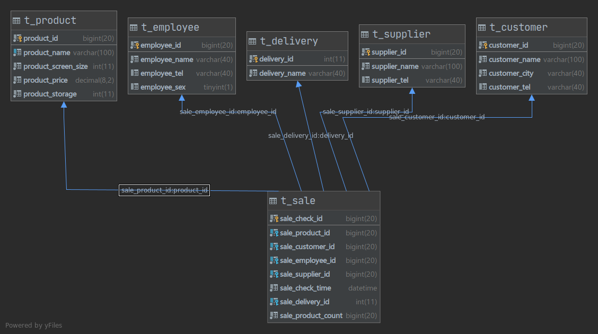

# 数据挖掘作业1

2017326603075    陈浩骏    17信科1班

---

## 说明

+ 选用`MySQL57(docker)`做数据库, 可视化部件为`pyecharts on Python3`.
+ 原表结构`./NorthWindData/northwind.sql`经过`./NorthWindData/ripChineseColumnName.sql`修改, 将列名表名均更名为ASCII字符集内能够表示的字符.

## 作业1.1

### 输出一张大表

> 所含信息有订单ID，产品ID，客户ID，雇员ID，供应商ID，时间ID，运货商，货主城市，单价高低（50一个等级），订单数，订单金额，商品数

#### SQL语句实现

```mysql
USE northwind;
# TODO: 订单量为主键, 订单数为列不合理, ditched corresponding column
# 输出一张大表，所含信息有订单ID，产品ID，客户ID，雇员ID，供应商ID，时间ID，运货商，货主城市，单价高低（50一个等级），订单数，订单金额，商品数
DROP VIEW IF EXISTS vOrderGlance;
CREATE VIEW vOrderGlance AS
SELECT tOrder.orderID     AS '订单ID',
       group_concat(tProduct.productID)  AS '涉及产品ID',
       group_concat(tProduct.pName)   AS '涉及产品名',
       tOrder.customerID      AS '顾客ID',
       group_concat(tProduct.supplierID)   AS '涉及供货商ID',
       date_format(tOrder.orderDate, '%Y-%m-%d')    AS '订单日期',
       tDeliveryCompany.dCompanyName      AS '送货公司',
       tOrder.ownerCity    AS '货主城市',
       cast(sum(tOrderDetail.productPrice * tOrderDetail.productCount
           * (1 - tOrderDetail.productDiscount)) AS DECIMAL(10, 2)) 
           AS '订单总价',
       count(tOrderDetail.productID)     AS '涉及商品数'
FROM tOrder,
     tOrderDetail,
     tProduct,
     tDeliveryCompany
WHERE tProduct.productID = tOrderDetail.productID
  AND tOrderDetail.orderID = tOrder.orderID
  AND tOrder.deliveryCompany = tDeliveryCompany.DeliveryCompanyID
GROUP BY tOrder.orderID;

```

#### Glance



## 作业1.2

### 输出销售额前十大客户的基本信息

#### SQL语句实现

```mysql
SELECT tCustomer.customerID           AS '顾客ID',
       tCustomer.cCompanyName         AS '顾客名',
       cast(sum(tOrderDetail.productCount * tOrderDetail.productPrice
           * (1 - tOrderDetail.productDiscount)) AS DECIMAL(14, 2)) 
           AS '总流水'
FROM tCustomer,
     tOrder,
     tOrderDetail
WHERE tCustomer.customerID = tOrder.customerID
  AND tOrder.orderID = tOrderDetail.orderID
GROUP BY tCustomer.customerID
ORDER BY 总流水 DESC
LIMIT 10;
```

#### Glance

> Using PyCharm/DataGrip -> Database -> Export to -> Markdown
>
> Pycharm/DataGrip -> 数据库 -> 导出至 -> Markdown

| 顾客ID | 顾客名       | 总流水    |
| :----- | :----------- | :-------- |
| QUICK  | 高上补习班   | 110277.30 |
| ERNSH  | 正人资源     | 104874.98 |
| SAVEA  | 大钰贸易     | 104361.95 |
| RATTC  | 学仁贸易     | 51097.80  |
| HUNGO  | 师大贸易     | 49979.90  |
| HANAR  | 实翼         | 32841.37  |
| KOENE  | 永业房屋     | 30908.38  |
| FOLKO  | 五洲信托     | 29567.56  |
| MEREP  | 华科         | 28872.19  |
| WHITC  | 椅天文化事业 | 27363.60  |

### 输出平均订单单价最高（总额/订单数）客户的基本信息；

#### SQL语句实现

```mysql
SELECT tCustomer.customerID                                                                            AS '顾客ID',
       tCustomer.cCompanyName                                                                          AS '顾客名',
       sum(tOrderDetail.productCount * tOrderDetail.productPrice * (1 - tOrderDetail.productDiscount)) AS '总流水',
       count(tOrder.customerID)                                                                        AS '单量',
       sum(tOrderDetail.productCount * tOrderDetail.productPrice * (1 - tOrderDetail.productDiscount)) /
       count(tOrder.customerID)                                                                        AS '平均价'
FROM tCustomer,
     tOrder,
     tOrderDetail
WHERE tCustomer.customerID = tOrder.customerID
  AND tOrder.orderID = tOrderDetail.orderID
GROUP BY tCustomer.customerID
ORDER BY 平均价 DESC
LIMIT 10;
```

#### Glance



### 输出库存不足三天销售的预警商品；
#### SQL语句实现

```mysql
# @-> Session-Wide Variable
SET @DAYSDIFF = 0;
SELECT to_days(max(tOrder.orderDate)) - to_days(min(tOrder.orderDate))
FROM tOrder
INTO @DAYSDIFF;
SELECT tProduct.productID,
       tProduct.pName   AS '商品名',
       tProduct.pStorage  AS '库存量',
       sum(tOrderDetail.productCount) / @DAYSDIFF  AS '日销量',
       sum(tOrderDetail.productCount) / @DAYSDIFF * 3 > tProduct.pStorage 
       AS '库存告急'
FROM tProduct,
     tOrderDetail
WHERE tOrderDetail.productID = tProduct.productID
GROUP BY tProduct.productID
ORDER BY 库存告急 DESC
LIMIT 100;
```

#### Glance

> Export using Method Mentioned Above

| productID | 商品名     | 库存量 | 日销量 | 库存告急 |
| :-------- | :--------- | :----- | :----- | :------- |
| 17        | 猪肉       | 0      | 1.4754 | 1        |
| 31        | 温馨奶酪   | 0      | 2.0820 | 1        |
| 53        | 盐水鸭     | 0      | 1.0760 | 1        |
| 29        | 鸭肉       | 0      | 1.1118 | 1        |
| 21        | 花生       | 3      | 1.5142 | 1        |
| 5         | 麻油       | 0      | 0.4441 | 1        |


### 输出订单最多的优秀雇员信息；
#### SQL语句实现

```mysql
SELECT tEmployee.employeeID                        AS '员工号',
       concat(tEmployee.eSurname, tEmployee.eName) AS '员工姓名',
       count(tOrder.orderID)                       AS '总单量'
FROM tEmployee,
     tOrder
WHERE tOrder.employeeID = tEmployee.employeeID
GROUP BY tOrder.employeeID
ORDER BY 总单量 DESC;
```

#### Glance

| 员工号 | 员工姓名 | 总单量 |
| :----- | :------- | :----- |
| 4      | 郑建杰   | 154    |
| 3      | 李芳     | 127    |
| 1      | 张颖     | 124    |
| 8      | 刘英玫   | 104    |
| 2      | 王伟     | 96     |
| 7      | 金士鹏   | 72     |
| 6      | 孙林     | 67     |
| 9      | 张雪眉   | 44     |
| 5      | 赵军     | 42     |

### 输出订单总金额的随时间变化图；
#### SQL语句实现

```mysql
SELECT year(tOrder.orderDate)  AS '年份',
       month(tOrder.orderDate) AS '月份',
       sum(tOrderDetail.productCount * tOrderDetail.productPrice * (1 - tOrderDetail.productDiscount)) 
       AS '销量'
FROM tOrder,
     tOrderDetail
WHERE tOrderDetail.orderID = tOrder.orderID
GROUP BY 年份, 月份
ORDER BY年份 ASC;
```

```python
xDate = []
ySellAmount = []
ySellAmountSum = []
with open('queryResult/SELECT_year_tOrder_orderDate_.csv', 'r', encoding='utf-8') as f:
    f.readline() # 跳表头
    for row in csv.reader(f):
        xDate.append('{}-{}'.format(row[0], row[1]))
        ySellAmount.append(round(float(row[2]), 0))

ySellAmountSum.append(ySellAmount[0])
for index in range(1, len(ySellAmount)):
    ySellAmountSum.append(ySellAmountSum[len(ySellAmountSum)-1]+ySellAmount[index])
    
graph1 = (
    Line(init_opts=opts.InitOpts(width="1600px", height="800px"))
    .add_xaxis(xDate)
    .add_yaxis("总销量", ySellAmountSum, is_smooth=True)
    .set_global_opts(title_opts=opts.TitleOpts(title="销量总金额"))
)

graph2 = (
    Bar(
        init_opts=opts.InitOpts(
            animation_opts=opts.AnimationOpts(
                animation_delay=1000, animation_easing="elasticOut"
            ), width="1600px", height="800px"
        )
    )
    .add_xaxis(xDate)
    .add_yaxis("每月销售量", ySellAmount)
    .set_global_opts(title_opts=opts.TitleOpts(title="每月销售金额"))
)
```

#### Glance

见后

### 输出商品销量的特征；即什么商品畅销，什么商品滞销;
#### SQL语句实现

```mysql
SELECT tProduct.productID,
       tProduct.pName                             AS '商品名',
       sum(tOrderDetail.productCount) / @DAYSDIFF AS '日销量'
FROM tProduct,
     tOrderDetail
WHERE tOrderDetail.productID = tProduct.productID
GROUP BY tProduct.productID
ORDER BY 日销量 DESC
LIMIT 30;

# 输出商品销量的特征
SELECT tCategory.categoryName AS '类目', count(tOrderDetail.productID) AS '销量'
FROM tCategory,
     tOrderDetail,
     tProduct
WHERE tOrderDetail.productID = tProduct.productID
  AND tProduct.categoryID = tCategory.categoryID
GROUP BY categoryName
ORDER BY 销量 DESC ;
```

#### Glance

| productID | 商品名   | 日销量 |
| :-------- | :------- | :----- |
| 60        | 花奶酪   | 2.3502 |
| 59        | 苏澳奶酪 | 2.2295 |
| 31        | 温馨奶酪 | 2.0820 |
| 56        | 白米     | 1.8838 |
| 16        | 饼干     | 1.7258 |
| ...       | ...      | ...    |

| 类目      | 销量 |
| :-------- | :--- |
| 饮料      | 405  |
| 日用品    | 365  |
| 点心      | 336  |
| 海鲜      | 330  |
| 调味品    | 214  |
| 谷类/麦片 | 197  |
| 肉/家禽   | 174  |
| 特制品    | 136  |

### 货主城市分析特征;

#### SQL语句实现

```mysql
SELECT tOrder.ownerRegion AS '地区', count(tOrder.ownerName) AS '频数'
FROM tOrder
GROUP BY ownerRegion
ORDER BY 频数 DESC ;

# 货主城市分析特征;
SELECT tOrder.ownerCity AS '城市', count(tOrder.ownerCity) AS '频数'
FROM tOrder
GROUP BY ownerCity
ORDER BY 频数 DESC ;
```

```python
xCity = []
yCityCount = []
with open('queryResult/SELECT_tOrder_ownerCity_AS_count_t.csv', 'r', encoding='utf-8') as f:
    f.readline()
    for row in csv.reader(f):
        xCity.append(row[0])
        yCityCount.append(int(row[1]))

graph3 = (
    Geo(init_opts=opts.InitOpts(width="1600px", height="800px"))
        .add_schema(maptype="china")
        .add(
        "geo",
        [list(z) for z in zip(xCity, yCityCount)],
        type_=ChartType.HEATMAP,
    )
        .set_series_opts(label_opts=opts.LabelOpts(is_show=True))
        .set_global_opts(
        visualmap_opts=opts.VisualMapOpts(),
        title_opts=opts.TitleOpts(title="货主位置热力图"),
    )
)
```

#### Glance

| 地区 | 频数 |
| :--- | :--- |
| 华北 | 355  |
| 华东 | 236  |
| 华南 | 85   |
| 西南 | 81   |
| 东北 | 65   |
| ...  | ...  |

| 城市   | 频数 |
| :----- | :--- |
| 天津   | 207  |
| 南京   | 85   |
| 北京   | 52   |
| 重庆   | 46   |
| 石家庄 | 40   |
| ...    | ...  |


### 可视化详见`./NorthWindData/Visualization.py`与`可视化.html`



## 全库数据导出SQL文件位于`NorthWindData/FULLExport.sql`

### 附加

此外加入了`./ExtraData`的数据分析, 利用`./ExtraData/SalesDataInit.py`以`sqlalchemy`做ORM框架, 生成了下列表结构的100万行销售数据, 可视化具体见`./ExtraData`目录中

